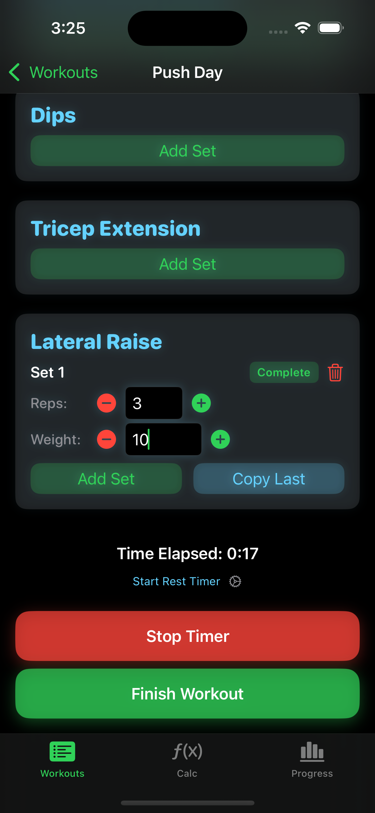
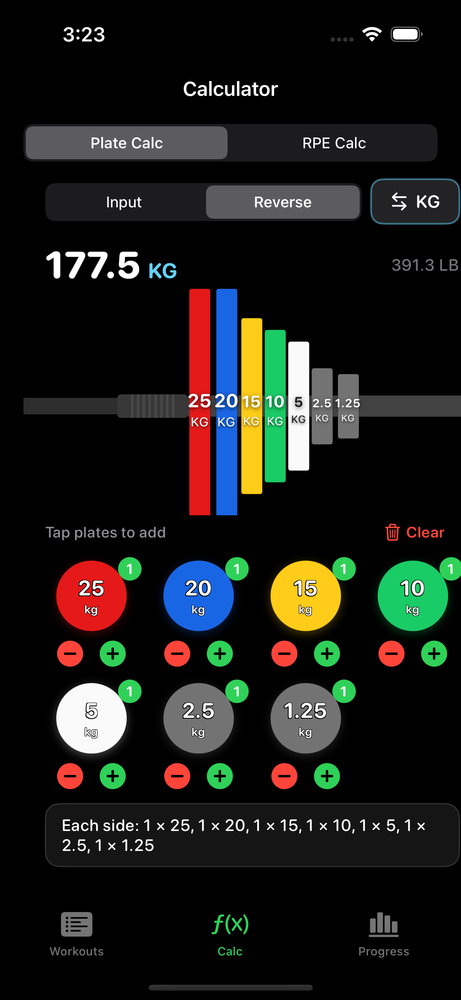

# OverLoad

An iOS app designed to help users track and manage their workouts effortlessly. Built with SwiftUI and Swift in Xcode!

## Table of Contents

- [Overview](#overview)
- [Features](#features)
- [Architecture](#architecture)
- [Data Models](#data-models)
- [Key Features Details](#key-features-details)
- [Project Structure](#project-structure)
- [User Workflow](#user-workflow)
- [Technical Details](#technical-details)
- [Visual Components](#visual-components)
- [Development Notes](#development-notes)
- [Screenshots](#-screenshots)
- [Future Improvements](#future-improvements)
- [Getting Started](#getting-started)

## Overview

OverLoad is a comprehensive workout tracking application that allows users to create workout templates, log exercise sessions with sets and reps, track progress over time, and use built-in calculators for plate loading and RPE (Rate of Perceived Exertion) calculations. The app features a modern dark-themed UI with neon accents and provides a seamless workout logging experience.

## Features

### Core Features
- **Workout Templates**: Create, edit, and manage reusable workout templates with custom exercises
- **Exercise Library**: Build and manage a personal library of exercises
- **Workout Logging**: Log workout sessions with sets, reps, and weights
- **Workout Timer**: Built-in timer to track workout duration with persistence across app restarts
- **Workout Recovery**: Resume in-progress workouts after app restart or backgrounding
- **Rest Timer**: Configurable rest timer between sets with pause/resume functionality
- **Progress Tracking**: View completed workout history with detailed session information
- **Workout Analytics**: Track total volume, average duration, and exercise statistics
- **Personal Records (PRs)**: Automatic tracking of max weight, max reps, and estimated 1RM for each exercise
- **Data Export**: Export workout data to CSV or JSON format
- **Search & Filter**: Search workouts by name or exercise, filter by date range, and sort by various criteria
- **Plate Calculator**: Calculate plate loading for barbells in both pounds (lbs) and kilograms (kg)
  - Input mode: Enter target weight and get plate configuration
  - Reverse mode: Select plates visually and calculate total weight
  - Visual barbell representation
- **RPE Calculator**: Estimate 1RM (One Rep Max) based on weight, reps, and RPE
- **Input Validation**: Automatic validation and clamping of reps (1-999) and weight (0-9999.9)
- **Error Handling**: Comprehensive error handling with user-friendly error messages
- **Data Persistence**: All data is saved locally using UserDefaults with automatic saving
- **Dark Mode UI**: Modern dark-themed interface with neon green/cyan accents

## Architecture

The app follows the **MVVM (Model-View-ViewModel)** architecture pattern:

### Models
- **`WorkoutTemplate`**: Represents a reusable workout template with a name and list of exercises
- **`Exercise`**: Represents an individual exercise with a name
- **`WorkoutSession`**: Represents a completed or in-progress workout session with date, duration, and exercise entries
- **`ExerciseEntry`**: Links an exercise to its sets within a workout session
- **`SetEntry`**: Represents a single set with reps and weight

### ViewModels
- **`WorkoutTemplateViewModel`**: Manages workout templates (CRUD operations, persistence)
- **`ExerciseLibraryViewModel`**: Manages the exercise library (add, remove, persistence)
- **`WorkoutSessionViewModel`**: Manages workout sessions (add, load, save, sorting, analytics, PRs)

### Views
- **`WorkoutApp`**: Main app entry point with TabView navigation
- **`WorkoutListView`**: Displays list of workout templates with active workout recovery
- **`CreateWorkoutView`**: Interface for creating new workout templates
- **`EditWorkoutTemplateView`**: Edit existing workout templates
- **`WorkoutDetailView`**: Active workout session interface with timer, set logging, and rest timer
- **`WorkoutProgressView`**: Displays completed workout history with search, filter, sort, and analytics
- **`CalcView`**: Container for calculator tools (Plate Calculator and RPE Calculator)
- **`PlateCalculatorView`**: Plate loading calculator with visual barbell
- **`RPECalculatorView`**: RPE-based 1RM calculator
- **`EditWorkoutView`**: Edit completed workout sessions (modify sets, reps, and weights)
- **`RestTimerSettingsView`**: Configure rest timer duration
- **`ShareSheet`**: Share exported workout data

## Data Models

### WorkoutTemplate
```swift
struct WorkoutTemplate: Identifiable, Codable {
    let id: UUID
    var name: String
    var exercises: [Exercise]
}
```

### Exercise
```swift
struct Exercise: Identifiable, Codable, Equatable {
    let id: UUID
    var name: String
}
```

### WorkoutSession
```swift
struct WorkoutSession: Identifiable, Codable {
    let id: UUID
    var templateID: UUID
    var name: String
    var date: Date
    var exerciseEntries: [ExerciseEntry]
    var duration: TimeInterval
    var isCompleted: Bool
    var isInProgress: Bool
    var timerStartTime: Date?
    var lastSavedTime: Date?
}
```

### ExerciseEntry
```swift
struct ExerciseEntry: Identifiable, Codable, Equatable {
    let id: UUID
    var exercise: Exercise
    var sets: [SetEntry]
}
```

### SetEntry
```swift
struct SetEntry: Identifiable, Codable, Equatable {
    let id: UUID
    var reps: Int
    var weight: Double
}
```

## Key Features Details

### Plate Calculator
- **Input Mode**: Enter target weight and bar weight to calculate required plates
- **Reverse Mode**: Visually select plates to calculate total barbell weight
- **Unit Conversion**: Switch between pounds (lbs) and kilograms (kg)
- **Visual Representation**: Barbell view showing plate arrangement
- **Available Plates**:
  - LBS: 45, 35, 25, 10, 5, 2.5
  - KG: 25, 20, 15, 10, 5, 2.5, 1.25

### RPE Calculator
- Calculates estimated 1RM based on:
  - Weight lifted
  - Number of reps (1-10)
  - RPE (Rate of Perceived Exertion: 1.0-10.0)
- Supports both lbs and kg
- Uses standard RPE percentage tables
- Two-card layout: "Last Set" (calculates e1RM) and "Next Set" (calculates target weight)

### Workout Timer
- Start/stop timer functionality
- Tracks total workout duration
- Timer state persists across app backgrounding and restarts
- Auto-saves workout progress every 30 seconds
- Can add sets even when timer is not running
- Resume in-progress workouts from the Workouts tab

### Rest Timer
- Configurable rest duration (default: 90 seconds)
- Start, pause, resume, and stop functionality
- Visual countdown with color-coded warnings (red when < 10 seconds)
- Automatically starts when completing a set
- Settings accessible from workout detail view

### Data Persistence
- All data stored locally using `UserDefaults` via `PersistenceService` abstraction
- Automatic saving on data modifications with debounced auto-save (0.5s delay)
- Data persists between app launches
- Active workout state is saved separately for recovery
- Corrupted data is automatically cleared to prevent crashes
- Keys used:
  - `"workoutTemplates"`: Workout templates
  - `"workoutSessions"`: Workout session history
  - `"exercises"`: Exercise library
  - `"activeWorkout"`: Currently in-progress workout session

### Workout Analytics
- **Total Volume**: Sum of all weight × reps across all workouts
- **Average Duration**: Mean workout duration
- **Exercises Performed**: Count of unique exercises
- **Personal Records (PRs)**: 
  - Max weight lifted for each exercise
  - Max reps performed for each exercise
  - Estimated 1RM based on best set (using RPE calculations)

### Data Export
- Export workout data to CSV format (compatible with Excel, Google Sheets)
- Export workout data to JSON format (for backup or integration)
- Share via iOS share sheet (AirDrop, email, etc.)
- Includes all workout sessions with complete set data

## Project Structure

```
MyWorkoutApp/
├── MyWorkoutApp/
│   ├── WorkoutApp.swift              # Main app entry point
│   ├── Models/
│   │   ├── WorkoutTemplate.swift
│   │   ├── Exercise.swift
│   │   ├── WorkoutSession.swift
│   │   ├── ExerciseEntry.swift
│   │   └── SetEntry.swift
│   ├── ViewModels/
│   │   ├── WorkoutTemplateViewModel.swift
│   │   ├── ExerciseLibraryViewModel.swift
│   │   └── WorkoutSessionViewModel.swift
│   ├── Views/
│   │   ├── WorkoutListView.swift
│   │   ├── CreateWorkoutView.swift
│   │   ├── EditWorkoutTemplateView.swift
│   │   ├── WorkoutDetailView.swift
│   │   ├── WorkoutProgressView.swift
│   │   ├── EditWorkoutView.swift
│   │   ├── CalcView.swift
│   │   ├── PlateCalculatorView.swift
│   │   ├── RPECalculatorView.swift
│   │   ├── RestTimerSettingsView.swift
│   │   ├── BarbellView.swift
│   │   ├── PlateView.swift
│   │   ├── PlatePickerGrid.swift
│   │   ├── StatRow.swift
│   │   └── ShareSheet.swift
│   ├── Services/
│   │   ├── PersistenceService.swift
│   │   ├── DataExportService.swift
│   │   └── WorkoutAnalytics.swift
│   ├── Utilities/
│   │   ├── AppErrors.swift
│   │   ├── InputValidators.swift
│   │   ├── RestTimer.swift
│   │   ├── Helpers.swift
│   │   └── KeyboardDismissModifier.swift
│   └── Assets.xcassets/
├── MyWorkoutAppTests/
│   ├── AppErrorsTests.swift
│   ├── InputValidatorsTests.swift
│   ├── WorkoutSessionTests.swift
│   ├── PlateCalculatorTests.swift
│   ├── RPECalculatorTests.swift
│   ├── ViewModelTests.swift
│   ├── PersistenceServiceTests.swift
│   ├── WorkoutAnalyticsTests.swift
│   └── RestTimerTests.swift
└── README.md
```

## User Workflow

1. **Create Exercise Library**: Add exercises to your library from the Create Workout screen
2. **Create Workout Template**: Select exercises from your library to create a reusable workout template
3. **Edit Templates** (Optional): Edit existing templates to modify exercises or names
4. **Start Workout**: Select a template from the Workouts tab to begin a session
   - If you have an in-progress workout, you can resume it from the top of the Workouts tab
5. **Log Sets**: Add sets with reps and weights for each exercise
   - Use +/- buttons for quick adjustments
   - Use "Copy Last" to duplicate previous set values
   - Complete sets to start the rest timer
6. **Manage Timer**: Start/stop the workout timer to track total duration
7. **Finish Workout**: Finish the workout to save it to history
8. **View Progress**: Check the Progress tab to see:
   - Overall statistics (total workouts, volume, average duration)
   - Personal records for each exercise
   - Complete workout history with search, filter, and sort options
9. **Export Data**: Export workout data to CSV or JSON from the Progress tab
10. **Use Calculators**: Access plate and RPE calculators from the Calc tab

## Technical Details

### Dependencies
- **SwiftUI**: Modern declarative UI framework
- **Foundation**: Core Swift functionality
- **UIKit**: Used for keyboard dismissal helper

### Minimum Requirements
- iOS 14.0+ (SwiftUI support)
- Xcode 12.0+

### Color Scheme
- Background: Black
- Primary Accent: Green (neon)
- Secondary Accent: Cyan
- Text: White/Gray
- Forced dark mode throughout the app

### Keyboard Handling
- Custom `KeyboardDismissModifier` allows tapping anywhere to dismiss keyboard
- Applied to all views with text input

### Visual Components

#### BarbellView
- Visual representation of a barbell with plates loaded on one side
- Shows bar shaft, grip zone, and sleeve
- Displays plates stacked in order with proper sizing

#### PlateView
- Individual plate visualization with:
  - Color coding based on weight (matches competition standards)
  - Size proportional to weight (larger plates = bigger visual)
  - Weight label and unit (lbs/kg)
  - Index numbers for large plates (45lb/25kg)
- **Color Scheme**:
  - **KG**: Red (25kg), Blue (20kg), Yellow (15kg), Green (10kg), White (5kg), Gray (2.5kg/1.25kg)
  - **LBS**: Blue (45lb), Yellow (35lb), Green (25lb), Dark (10lb/5lb/2.5lb)

#### PlatePickerGrid
- Interactive grid for selecting plates in reverse calculator mode
- Shows all available plates with +/- buttons
- Displays count of each selected plate
- Color-coded to match PlateView

## Development Notes

### Data Flow
1. **Workout Templates**: Created in `CreateWorkoutView` → Saved via `WorkoutTemplateViewModel` → Displayed in `WorkoutListView`
2. **Workout Sessions**: Created from templates in `WorkoutDetailView` → Logged during workout → Saved via `WorkoutSessionViewModel` → Displayed in `ProgressView`
3. **Exercise Library**: Managed in `ExerciseLibraryViewModel` → Used when creating workout templates

### Key Implementation Details
- **State Management**: Uses `@StateObject` and `@ObservedObject` for ViewModels
- **Persistence**: Abstracted through `PersistenceService` protocol for better testability
- **Error Handling**: Custom `AppError` enum with localized error descriptions
- **Input Validation**: `InputValidators` utility for clamping reps and weight values
- **Navigation**: Uses SwiftUI NavigationView and sheet presentations
- **Timer**: Uses `Timer.scheduledTimer` for workout duration tracking with state persistence
- **Auto-Save**: Debounced auto-save (0.5s delay) to reduce I/O operations and improve performance
- **Unit Conversion**: Plate calculator handles real-time conversion between lbs and kg
- **RPE Table**: Hardcoded RPE percentage table based on standard powerlifting formulas
- **Testing**: Comprehensive unit test suite with mock persistence service

### Performance Optimizations
- **Debounced Auto-Save**: Reduces save operations from every keystroke to once after typing stops
- **Local Text Field State**: Prevents unnecessary re-renders during typing
- **Efficient Data Structures**: Optimized for quick lookups and filtering

### Known Limitations
- Data stored in UserDefaults (not suitable for very large datasets)
- No cloud sync or backup functionality (data export available as workaround)
- Exercise library is shared across all workouts (no per-workout exercises)
- Timer state is saved but requires manual resume after app restart (automatic resume coming soon)

## 📸 Screenshots

<div align="center">
  
  <table>
    <tr>
      <td align="center">
        <h4>Workouts Tab</h4>
        
      </td>
      <td align="center">
        <h4>Plate Calculator</h4>
        
      </td>
    </tr>
    <tr>
      <td align="center">
        <h4>RPE Calculator</h4>
        
      </td>
      <td align="center">
        <h4>Progress Tab</h4>
        
      </td>
    </tr>
    <tr>
      <td align="center" colspan="2">
        <h4>Workout Detail</h4>
        
      </td>
    </tr>
  </table>
  
</div>


## Future Improvements

- **Goal-Setting Feature**: Allow users to set personal goals and milestones
- **Enhanced Analytics**: Provide more in-depth analysis with charts and graphs
- **Social Sharing**: Enable sharing achievements with friends on social media
- **Cloud Sync**: Add iCloud or other cloud storage for data backup and sync across devices
- **Exercise Notes**: Add notes field for exercises and sets
- **Workout Templates Sharing**: Share workout templates with other users
- **Body Weight Tracking**: Track body weight alongside workouts
- **Progressive Overload Tracking**: Visual indicators for progressive overload
- **Exercise History**: View historical performance for specific exercises with charts
- **Workout Statistics**: Weekly/monthly statistics and trends with visualizations
- **Automatic Workout Recovery**: Auto-resume workouts on app launch
- **Custom Plate Sets**: Allow users to customize available plate weights
- **Workout Templates**: Pre-built templates for common programs (5/3/1, Starting Strength, etc.)
- **Dark/Light Mode Toggle**: Allow users to switch themes
- **Widget Support**: iOS home screen widgets for quick workout stats

## Getting Started

### Prerequisites
- Xcode (latest version recommended)
- iOS device or Simulator

### Installation
1. Clone the repository:
   
```bash
git clone https://github.com/DavidSantosTXUSA/OverLoad.git
```

2. Open project in Xcode:
```bash
cd OverLoad
open MyWorkoutApp/MyWorkoutApp.xcodeproj
```

3. Select a simulator or connected device

4. Build and run (⌘R) or click the Play button

5. Run the app! Have fun :)

### Running Tests
To run the test suite:
1. Press `⌘U` in Xcode, or
2. Select "Product" → "Test" from the menu, or
3. Use the Test Navigator (⌘6) to run individual tests

### Requirements
- **iOS**: 18.0+
- **Xcode**: 16.0+
- **Swift**: 5.0+
- **SwiftUI**: Required

## Contributing

Contributions are welcome! Please feel free to submit a Pull Request.

## License

This project is open source. See the repository for license details.

## Acknowledgments

- Built with SwiftUI and Swift
- Uses standard powerlifting RPE tables for 1RM calculations
- Plate colors follow competition standards (IPF/IWF)
